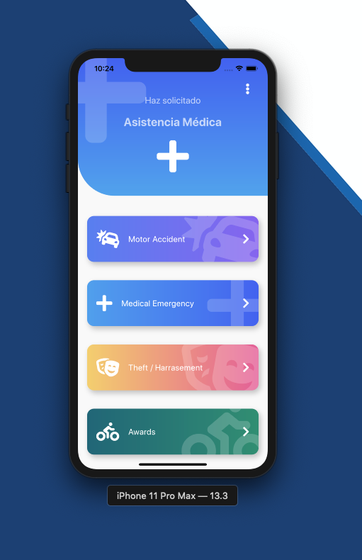
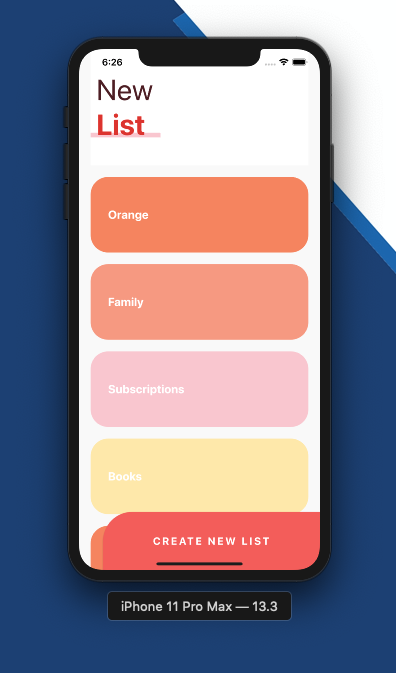

# Flutter Intermedio: Diseños profesionales y animaciones

Del curso de Fernando Herrera: https://cursos.devtalles.com/courses/flutter-Intermedio

## Backgrounds - Custom Painter

Solo he creado un nuevo proyecto llamado `design_app`

### Temas puntuales de la sección

En esta sección tocaremos los siguientes temas:

- CustomPainter
- Paint
- LineTo
- ¿Cómo coloreamos una figura?
- Diferentes fondos de aplicaciones
- QuadraticBezierTo
- Dimensiones donde podemos pintar
- Canvas

### Header cuadrado

En la carpeta `lib` creo una carpeta `src`.

En la carpeta `src` creo dos carpetas, una llamada `pages` y otra llamada `widgets`.

En la carpeta `widgets` creo un archivo llamado `headers.dart`. Aquí se crearán todas las clases necesarias de cada uno de los diseños.

Creo la clase `HeaderCuadrado`.

En la carpeta `pages` creo un archivo llamado `headers_page.dart`. Este archivo llamará a las distintas clases de `headers.dart`.

### Header circular

Añadimos una clase `HeaderBordesRedondeados` a `headers.dart` que llamamos desde `headers_page.dart`.

### Presentación sobre el customPainter

El CustomPainter necesita dos métodos, uno llamado `paint()` y otro llamado `shouldRepaint()` que siempre vamos a hacer que devuelva true porque nuestros diseños son muy sencillos y no demandan mucho del procesador ni de la memoria. Si el diseño fuera muy complejo, `shouldRepaint()` debería de devolver false.

El método `void paint(Canvas canvas, Size size)` se sobreescribe. El canvas es el lienzo donde se puede diseñar (la pantalla) y el Size es el tamaño que tiene ese Canvas, la dimensión de la pantalla que tengamos.

El CustomPainter nos da también un pequeño lápiz que podemos mover y dibujar lo que queramos, usando coordenadas.

La esquina superior izquierda es la `(0, 0)`. La esquina inferior izquierda es `(0, size.height)`.

La esquina superior derecha es la `(size.width, 0)`. La esquina inferior derecha es `(size.width, size.height)`.

Si estamos en la posición centro-derecha, las coordenadas serían `(size.width, size.height * 0.5)`.

### Header diagonal

Añadimos las clases `HeaderDiagonal` y `_HeaderDiagonalPainter` a `headers.dart` que llamamos desde `headers_page.dart`.

### Header triángulo

Añadimos las clases `HeaderTriangular` y `_HeaderTriangularPainter` a `headers.dart` que llamamos desde `headers_page.dart`.

### Header pico

Añadimos las clases `HeaderPico` y `_HeaderPicoPainter` a `headers.dart` que llamamos desde `headers_page.dart`.

### Header curvo

Añadimos las clases `HeaderCurvo` y `_HeaderCurvoPainter` a `headers.dart` que llamamos desde `headers_page.dart`.

### Header waves

Añadimos las clases `HeaderWave` y `_HeaderWavePainter` a `headers.dart` que llamamos desde `headers_page.dart`.

### CustomPainter con gradiente

Añadimos las clases `HeaderWaveGradient` y `_HeaderWaveGradientPainter` a `headers.dart` que llamamos desde `headers_page.dart`.

## Animaciones personalizadas

### Preparando la pantalla para animar

En la carpeta `pages` creamos un nuevo archivo `animaciones_page.dart` y creamos las clases `AnimacionesPage`, `CuadradoAnimado`, `_CuadradoAnimadoState` y `_Rectangulo`.

En `main.dart` llamamos a `AnimacionesPage()`.

### Animation y AnimationController

Nos centramos en animaciones personalizadas. Para poder crearlas, necesitamos:

- AnimationController
  - Es un control que nos sirve para manejar la animación
  - Por defecto su situación es de parada
  - Si indicamos `controller.forward()` la animación empieza a ejecutarse
  - Pensar en el AnimationController como en la barra de un video de YouTube, donde podemos parar, pausar, adelantar, ejecutar hacia atrás, ejecutar normal... un video
  - En el método `initState()` del ciclo de vida de un Stateful Widget inicializamos el controller
  - Es importante utilizar el método `dispose()` del ciclo de vida de un Stateful Widget para deshacernos del controller
- Animation
  - Es el tipo de cosa que queremos animar, por ejemplo, rotar un cuadro...
  - Tenemos que indicar quien controla esta animación, es decir, le pasamos el controller

Vamos a modificar la clase `_CuadradoAnimadoState` de `animaciones_page.dart`.

### AnimatedBuilder y la rotación

Ya tenemos el controlador y como queremos que varíe la rotación.

Modificamos el método `build()` de la clase `_CuadradoAnimadoState` para que devuelva un `AnimatedBuilder`.

### Animation Listener y Animation Status

Los listeners se añaden en el método initState() de un Stateful Widget.

Modificamos el método `initState()` de la clase `_CuadradoAnimadoState`.

### Curves

https://easings.net/en

Tal y como tenemos la animación hasta este momento, se le conoce como alinación lineal, es decir, no hay acelaración al inicio o al final, es constante durante el tiempo que dura la misma.

Los curves nos permiten alterar la aceleración de una animación en distintos momentos de la vida de esta.

Modificamos el método `initState()` de la clase `_CuadradoAnimadoState`.

### Múltiples animaciones simultáneas

Imaginemos que, además de la animación actual, queremos otra animación animando otra propiedad.

Vamos a hacer que nuestro objeto tenga una opacidad muy baja al inicio y que, conforme pasa el tiempo, se vaya haciendo más opaco, es decir, un faded in.

Aunque existen formas en Flutter de hacerlo, lo vamos a controlar nosotros manualmente.

Notar que solo necesitamos un controller.

Modificamos `_CuadradoAnimadoState` añadiendo la variable `opacidad`. La configuración de la opacidad la indicamos en el método `initState()` y modificamos también el método `build()` para indicar un Widget `Opacity()` dentro del `AnimatedBuilder`.

### Animar en intervalos de tiempo

Podemos alterar la aceleración de la animación de la opacidad usando curves.

También vamos a controlar en que punto del tiempo queremos que empiece a ejecutarse esta animación, la de la opacidad, mientras se sigue ejecutando la animación de la rotación.

Usaremos siempre el mismo controller.

Modificamos el método `initState()` de `_CuadradoAnimadoState`.

### Mover el cuadrado

Vamos a crear una nueva propiedad (una nueva animación) llamada `moverDerecha` en la clase `_CuadradoAnimadoState` para mover el cuadrado a la derecha.

También aplicamos curves.

Modificamos el método `initState()` para iniciar nuestra nueva propiedad.

Para hacer que realmente se mueva modificamos el método `build()`.

### Escalar el cuadrado

Vamos a crear una nueva propiedad (una nueva animación) llamada `agrandar` en la clase `_CuadradoAnimadoState` para agrandar el cuadrado.

Modificamos el método `initState()` para iniciar nuestra nueva propiedad.

Para hacer que realmente se mueva modificamos el método `build()`.

### Determinar el estado de una animación

Los distintos estados de una animación son:

- isCompleted
- isDismissed
- isAnimating
- isForwardOrComplete

Por ejemplo, podemos hacer `opacidad.status` para saber su status, o `controller.status`, o preguntar por un estado en concreto, por ejemplo `agrandar.isCompleted`.

No olvidar la propiedad `value`, por ejemplo `opacidad.value` para saber el valor actual.

### FadeOut de la opacidad

Hago una tarea para hacer que la opacidad desaparezca en el último segundo de la animación (recordar que el total de la animación son 4sg)

Creamos una nueva propiedad (animación) llamada `opacidadOut`.

Modificamos el método `initState()` para iniciar nuestra nueva propiedad.

Para hacer que realmente se haga la opacidad, modificamos el método `build()`.

### Inicio de un nuevo reto

En la carpeta `src` creamos la carpeta `retos` y dentro creamos el archivo `cuadrado_animado_page.dart`.

En `main.dart` llamamos a `CuadradoAnimadoPage()`.

## ProgressBar circular - Animated Custom Painter

### Temas puntuales de la sección

En esta sección tocaremos los siguientes temas:

- Repaso del custom painter
- Dibujo de arcos
- Dibujo de círculos
- Animar custom painters
- Crear un widget de progreso circular
- Decoración de las puntas del custom painter
- Dibujar sobre otros painters
- Transformación en un widget re-utilizable
- Y más

Durante la sección hay tareas y ejercicios que les pido que intenten hacer, eso nos ayuda a reforzar lo aprendido.

### Preparación del espacio para trabajar

En la carpeta `pages` creamos el archivo `circular_progress_page.dart`.

En este archivo, que luego vamos a llevar a una carpeta de referencias, vamos a hacer "como podamos" un Circular Progress Indicator.

Luego lo haremos de forma correcta, y ese archivo será el que podremos reutilizar.

Actualizamos `main.dart` para que utilice nuestro nuevo archivo.

### CustomPainter - Círculos y Arcos

Seguimos modificando `circular_progress_page.dart`.

### Cambiando el valor dinámicamente

Seguimos modificando `circular_progress_page.dart`.

### Animando el arco

Seguimos modificando `circular_progress_page.dart`.

### Crear una página para usar el CircularProgress

Aquí es donde optimizamos todo para poder reutilizarlo, porque tal y como está ahora, es muy difícil de usarlo en distintos sitios.

En la carpeta `src` creamos la carpeta `labs`, donde acabarán nuestros experimentos.

Movemos `circular_progress_page.dart` a esa carpeta, porque no lo vamos a utilizar más. En `main.dart` eliminamos toda referencia a esa página.

En la carpeta `pages` creamos un fichero llamado `graficas_circulares_page.dart`. El objetivo es volver a hacer el Circular Progress Indicator, pero siendo muy fácil de reutilizar.

Actualizamos `main.dart` para que utilice nuestro nuevo archivo.

### Creando nuestro widget personalizado

Vamos a crear un widget reutilizable.

En la carpeta `widgets` creamos el archivo `radial_progress.dart`.

### Dibujar el círculo y el arco inicial

Seguimos modificando `radial_progress.dart`.

### Animando mi RadialProgress Widget

Seguimos modificando `radial_progress.dart`.

### Añadiendo personalización a nuestro RadialProgress

Seguimos modificando `graficas_circulares_page.dart` y `radial_progress.dart`.

### Jugando con nuestro RadialProgress

Ponemos 4 RadialProgress en pantalla.

Seguimos modificando `graficas_circulares_page.dart`.

### CircularProgress con gradiente

Modificamos `radial_progress.dart`.

## Slideshow

### Temas puntuales de la sección

En esta sección tocaremos los siguientes temas:

- Pageviews
- AnimatedContainer
- Controller
- Listeners
- Provider
- Reutilizar el widget
- Multiples instancias de provider para multiples slideshows
- ChangeNotifierProvider
- Personalización
- Y más

Adicionalmente, al terminar la sección, notarán que si colocamos el dispositivo en modo landscape u horizontal, no se verá muy bien, pero esto lo terminaremos arreglando un poco más adelante.

### Inicio del espacio para trabajar

En la carpeta `pages` creamos el archivo `slideshow_page.dart`.

Actualizamos `main` para llamar a nuestra nueva page.

Vamos a trabajar con SVGs de la página `https://undraw.co/`, que son gratuitas.

En la raiz del proyecto creamos la carpeta `assets/svgs` y guardamos ahí las imágenes SVG descargadas.

### Mostrando SVGs en pantalla

Vamos a mostrar los archivos SVG en pantalla.

Para hacer esto instalamos el paquete `flutter_svg`. Ver su documentación aquí: `https://pub.dev/packages/flutter_svg#-installing-tab-`.

También tenemos que habilitar nuestros assets. Para ello, en el fichero `pubspec.yaml` indico:

```yaml
flutter:
  assets:
    - assets/svgs/
```

Modificamos `slideshow_page.dart`.

### PageView - Creando un Slideshow

Vamos a enfocarnos en la lógica de nuestra aplicación.

Modificamos `slideshow_page.dart` creando las clases privadas `_Slides` y `_Slide` que acabaremos optimizando.

### Diseño de los puntos indicadores

Vamos a crear los puntos indicadores para saber en que página me encuentro.

Modificamos `slideshow_page.dart` y creamos las clases privadas `_Dots` y `_Dot`.

### PageViewController - Escuchar cambios de páginas

Controlamos el estado de la aplicación para saber en que slide estamos y así colorear el punto indicador respectivo.

Modificamos `slideshow_page.dart`.

### Provider - Compartir la página actual

Si estoy en el slide 1, ¿cómo hago para colorear el punto indicador 1? Necesitaremos comunicarnos entre Widgets y para eso usaremos Provider.

Provider nos permite manejar una instancia global de alguna clase.

Instalamos `provider`. Ver la documentación: `https://pub.dev/packages/provider`.

En la carpeta `src` creamos la carpeta `models` y dentro el archivo `slider_model.dart`.

Modificamos `slideshow_page.dart`.

### ChangeNotifierProvider - Instanciar nuestra clase

Empezamos a configurar y usar nuestro provider en `slideshow_page.dart`.

### Cambio de color con animación

Modificamos `slideshow_page.dart` para que el cambio de punto indicador se haga con una animación.

Vamos a usar `AnimatedContainer`.

### Widget Slideshow - Inicio de optimizaciones

Refactorizamos `slideshow_page.dart`.

Movemos `slideshow_page.dart` a la carpeta `labs` y creamos en la carpeta `pages` un nuevo archivo `slideshow_page.dart` ya optimizado.

En la carpeta `widgets` creamos el archivo `slideshow.dart`. Será un widget reutilizable.

### Enviando Widgets a nuestro Slideshow

Modificamos `slideshow.dart` para recibir las imágenes de manera dinámica.

Modificamos `slideshow_page.dart`.

### Mostrando puntos dependiendo de la cantidad de slides

Modificamos `slideshow.dart` para que tenga en cuenta el número de slides al mostrar los puntos indicadores.

### Añadiendo personalización a nuestro Slideshow

Vamos a crear propiedades que recibirá nuestro Slideshow.

- Posibilidad de poner los puntos indicadores arriba o abajo
- Cambio de colores de los puntos indicadores

Modificamos `slideshow_page.dart` y `slideshow.dart`.

### Configuraciones usando provider

En vez de ir pasando propiedades de padres a hijos, vamos a usar el provider para gestionar los valores de estas propiedades.

Para no perder lo que ya tengo, me llevo una copia de `slideshow.dart` a la carpeta `labs`.

Modificamos `slideshow_page.dart` y `slideshow.dart`.

### bulletPrimario, bulletSecundario

Vamos a seguir implementando propiedades y trabajando con provider.

Modificamos `slideshow_page.dart` y `slideshow.dart`.

### Colocando dos slideshows

Modificamos `slideshow_page.dart`.

## Pinterest Layout y menú

### Temas puntuales de la sección

En esta sección tocaremos los siguientes temas:

- Pinterest Layout
- Diseño de columnas
- Menú flotante
- Controladores del scroll
- Listeners
- Ocultar y mostrar el menú con scroll
- Personalización
- Re-utilización del widget
- Posicionamiento
- Enviar funciones como argumento
- Y más

### Nota de actualización

Hay que instalar el paquete `flutter_staggered_grid_view`.

Recomendamos instalar la versión ^0.4.1 o inferior.

`flutter_staggered_grid_view: ^0.4.1`

Si usamos una versión superior, esta trae cambios y tendremos que revisar la documentación para realizar la implementación, diferente a la del curso.

Documentación: `https://pub.dev/packages/flutter_staggered_grid_view#-readme-tab-`

### Inicio de proyecto - Pinterest

En la carpeta `pages` nos creamos el archivo `pinterest_page.dart`.

Actualizamos `main.dart` para que apunte a la nueva página.

Instalamos la dependencia `flutter_staggered_grid_view: ^0.4.1`.

### Pinterest Menú 

Para crear el menú, en la carpeta `widgets` creamos el archivo `pinterest_menu.dart`.

Vamos a recibir un icono y el callback que queremos ejecutar cuando se presiona.

Modificamos `pinterest_page.dart` para incluir el menú.

### Diseño de nuestro menú

Modificamos `pinterest_menu.dart`.

### Diseño del botón del menú

Modificamos `pinterest_menu.dart`.

### Activar opción del menú

Modificamos `pinterest_menu.dart`.

Vamos a usar Provider para pasar información entre widgets.

### Colocar nuestro menú sobre el grid

Modificamos `pinterest_menu.dart` y `pinterest_page.dart`.

### Mostrar y ocultar el menú con el Scroll

Modificamos `pinterest_page.dart` para saber cuando estamos haciendo scroll arriba o abajo.

### Cambiar la opacidad del menú

Modificamos `pinterest_menu.dart` creando una propiedad para que se muestre el menú o desaparezca, usando la opacidad.

Modificamos `pinterest_page.dart` para comunicarme con el widget `pinterest_menu.dart`. Uso Provider.

### Personalización a nuestro menú

Corregimos `pinterest_page.dart` para hacer que, si subimos el grid muy rápido, cuando haga el rebote no aparezca y desaparezca el menú.

Modificamos `pinterest_menu.dart` para recibir un par de argumentos adicionales. Las implementaremos en el provider.

### Argumento de menu items

Modificamos `pinterest_menu.dart` para que los items de los menús puedan pasarse como argumentos desde `pinterest_page.dart`.

## Emergency Layout

### Temas puntuales de la sección

En esta sección tocaremos los siguientes temas:

- Custom Headers
- Botones
- Funciones como argumentos
- Re-utilización de widgets
- Gradientes
- Clips
- Android Physics
- Animaciones básicas para listviews
- Stacks
- Emular en múltiples dispositivos simultáneamente
- Y más

### Inicio de proyecto - Emergency

Vamos a hacer este diseño:



En la carpeta `pages` nos creamos el archivo `emergency_page.dart`.

Actualizamos `main.dart` para que apunte a la nueva página.

### IconHeader

Vamos a hacer la parte del Header de la pantalla como un widget reutilizable.

En la carpeta `widgets` creamos el archivo `icon_header.dart`.

Modificamos `emergency_page.dart` para llamar a nuestro nuevo widget.

### Iconos y textos de mi IconHeader

Instalamos la dependencia `font_awesome_flutter`. Documentación: `https://pub.dev/packages/font_awesome_flutter#-readme-tab-`.

Modificamos `icon_header.dart`.

### Parametrizando nuestro IconHeader

Vamos a recibir argumentos para poder reutilizar nuestro IconHeader.

Modificamos `icon_header.dart` y `emergency_page.dart`.

### Creando los botones

Vamos a hacer las opciones de menú que hay debajo de IconHeader.

Vamos a crear uno y a reutilizarlo para los demás.

En la carpeta `widgets` creamos el archivo `boton_gordo.dart`.

Modificamos `emergency_page.dart` para llamar a nuestro nuevo widget.

### Información dentro del botón

Modificamos `boton_gordo.dart` y `emergency_page.dart`.

### Parametrizando nuestro botón

Vamos a recibir argumentos para poder reutilizar nuestro BotonGordo.

Modificamos `boton_gordo.dart` y `emergency_page.dart`.

### BotonGordo y nuestro IconHeader

Ponemos junto nuestro IconHeader y una lista de BotonGordo.

Modificamos `emergency_page.dart`.

### Android physics y botón menú

En un terminal Android, cuando llegamos al final de los items y hacemos el pull, en vez de tener el comportamiento de Ios (un rebote), aparece como una imagen indicando que se ha llegado al final de la lista.

Lo cambiamos para que sea un comportamiento como el de Ios.

También mostramos un botón de menú en nuestro IconHeader.

Modificamos `emergency_page.dart`.

### Animate_do y emular en dos dispositivos al mismo tiempo

Instalamos el paquete `animate_do`. Documentación: `https://pub.dev/packages/animate_do#-readme-tab-`.

Modificamos `emergency_page.dart` para meter animaciones.

Podemos emular en dos dispositivos Androids, o en Android e Ios, por ejemplo.

Para esto, ejecutar en la terminal el comando: `flutter run -d all`.

Esto tarda un poco.

## Sliver List App

### Temas puntuales de la sección

En esta sección tocaremos los siguientes temas:

- Slivers
- Sliver AppBar
- SliverList
- CustomSliver
- SliverPersistentHeaderDelegate
- Botones con bordes redondeados en posiciones específicas
- Y más

### Inicio de la aplicación - SliverListApp

Vamos a hacer este diseño:



La diferencia con el Emergency Layout es que en este diseño el header se mueve hacia arriba y se oculta, para dar más espacio a los items de la lista.

Si volvemos a bajar los items, el header vuelve a mostrarse.

En la carpeta `pages` nos creamos el archivo `sliver_list_page.dart`.

Actualizamos `main.dart` para que apunte a la nueva página.

### Diseño básico de la aplicación

Modificamos `sliver_list_page.dart`.

### Lista de items en base a un arreglo

Vamos a trabajar con los colores y los textos.

Modificamos `sliver_list_page.dart`.

### CustomScrollView y Slivers

Vemos los Widgets CustomScrollView, SliverAppBar y SliverList.

Modificamos `sliver_list_page.dart`.

### SliverPersistentHeaderDelegate

Trabajamos con un sliver personalizado.

Modificamos `sliver_list_page.dart`.

### Botón personalizado flotante

Es un botón fijo que está al fondo a la derecha.

Modificamos `sliver_list_page.dart`.

## Temas para nuestra aplicación

### Temas puntuales de la sección

En esta sección tocaremos los siguientes temas:

- Tema Light
- Tema Dark
- Tema personalizado
- ThemeChanger
- Provider
- MultiProvider
- Switches
- Uso de propiedades del tema
- Uso de colores del tema
- Y más

### Temas

En la carpeta `pages` creamos el archivo `launcher_page.dart`.

Actualizamos `main.dart` para que apunte a la nueva página.

### Rutas de nuestra aplicación

En la carpeta `src` creamos la carpeta `routes` y dentro el archivo `routes.dart`.

Vamos a definir todas las rutas que va a tener nuestra aplicación.

Modificamos `launcher_page.dart` para trabajar las opciones del menú usando `routes.dart`.

### Provider - ThemeChanger

Para poder modificar los switches del Drawer de mi app, vamos a utilizar Provider.

En la carpeta `src` creamos la carpeta `theme` y dentro creamos el archivo `theme.dart`.

Modificamos `main.dart` para añadir el tema creado y que sea accesible en toda la app.

Modificamos `launcher_page.dart` para poder modificar los switches.

### Dark y Light Themes

Cambiamos el tema de la app.

Modificamos `main.dart` para añadir la propiedad `theme`.

Tenemos que saber el tema preestablecido y dicho valor preestablecido lo indicamos en `theme.dart`.

### Usando colores del tema seleccionado

Vamos a personalizar nuestra aplicación con diferentes colores en función del tema seleccionado.

Modificamos `launcher_page.dart`.

Modificamos `slideshow_page.dart`.

### Aplicando temas en otras pantallas

Seguimos personalizando nuestra aplicación.

Modificamos `pinterest_page.dart`, `graficas_circulares_page.dart`, `headers_page.dart`.

### Tema en la página de los Slivers

Seguimos personalizando nuestra aplicación.

Modficamos `sliver_list_page.dart`.

### Creando un diseño personalizado

Si cambiamos `currentTheme` en `theme.dart` cambio el tema global en mi app.

También modifico `launcher_page.dart`.

## Diseño landscape, portrait y tablets

### Temas puntuales de la sección

En esta sección tocaremos los siguientes temas:

- Diseño en tabletas
- Optimizaciones para celulares
- Landscape y portrait
- Orientation detection
- MediaQuery
- Alinear proporcionalmente
- Retoques en cada página creada hasta el momento para asegurarnos que funcione bien
- Diseño de dos columnas
- Y más

### Orientation Builder

Si giramos el dispositivo y lo dejamos en horizontal, todo sigue funcionando, pero se ve feo.

Igualmente, si abrimos nuestra app en una tableta, debería de adaptarse para aprovechar todo el espacio, pero tampoco lo hace.

A día de hoy, no hay tantísima diferencia entre un móvil y una tableta, y no se usa tanto Orientation Builder.

Es un poco inútil porque no debería ser la base del diseño saber si estoy en portrait o landscape.

Lo importante es el tamaño del dispositivo.

Modificamos `main.dart` para añadir `OrientationBuilder()`.

Abrimos un emulador de Ipad de 11 pulgadas y, para ejecutar en los dos dispositivos, ejecutar en la terminal lo siguiente: `flutter run -d <id_dispositivo>`. Entonces, el emulador de Iphone se ejecuta en VSCode y el del IPad en la terminal.

Para el IPad sería `flutter run -d 39102D1D-6A23-402C-A770-E657791E45D5`

Para hacer un hot reload, pulsar `r` en el terminal.

Veremos que en portrait, en el IPad, se nota que la app no está hecha para ese dispositivo.

### Layout tableta y teléfono

Hacemos una copia de `launcher_page.dart`. A la copia le pongo el nombre `launcher_tablet_page.dart` y trabajo con ella.

Vamos a trabajar en base a resoluciones de pantalla.

Es decir, en la tablet voy a trabajar con `launcher_tablet_page.dart`, pero si giro el móvil, también voy a trabajar con `launcher_tablet_page.dart`. Me refiero a dispositivos anchos.

Modifico `main.dart` para tomar la decisión de qué archivo de los dos mostrar, `launcher_page.dart` o `launcher_tablet_page.dart`.

Pero recordar que no lo vamos a hacer en función de la orientación, sino de las resoluciones o píxeles.

### Diseño de dos columnas - Tablet

En tabletas suelen hacerse diseños basados en dos columnas, en la parte izquierda el menú principal u opciones, y en la parte derecha la opción seleccionada.

Modificamos `launcher_tablet_page.dart` para que el diseño quede optimizado para tabletas.

### Navegar en diseño de dos columnas

Tenemos como problema que, si en la tableta hacemos click en cualquier opción, navega completamente a dicha opción, perdiendo el diseño de dos columnas.

Para solucionar este problema, vamos a trabajar con un Provider especializado en la navegación de la parte derecha.

En la carpeta `models` creamos el archivo `layout_model.dart`.

Este provider lo colocamos en `main.dart`.

Modificamos `launcher_tablet_page.dart` para que, si cambio de página, leer de nuestro provider para establecer la nueva página.

### SlideshowPage - Cambiando columnas por rows

Cuando giramos el móvil, la página `slideshow_page.dart` se ve mal. En la tableta, al girarla si se ve bien.

Sin embargo, el cálculo se aplicará para ambas porque puede haber tabletas muy delgadas.

De nuevo, no es importante hablar de tabletas o móviles, sino del tamaño en pixeles.

Modificamos `slideshow_pagedart`.

### EmergencyPage

Modificamos `emergency_page.dart` para que, cuando giramos los dispositivos se vea correctamente.

### PinterestPage

Modificamos `pinterest_page.dart` para que, cuando giramos los dispositivos se vea correctamente.
